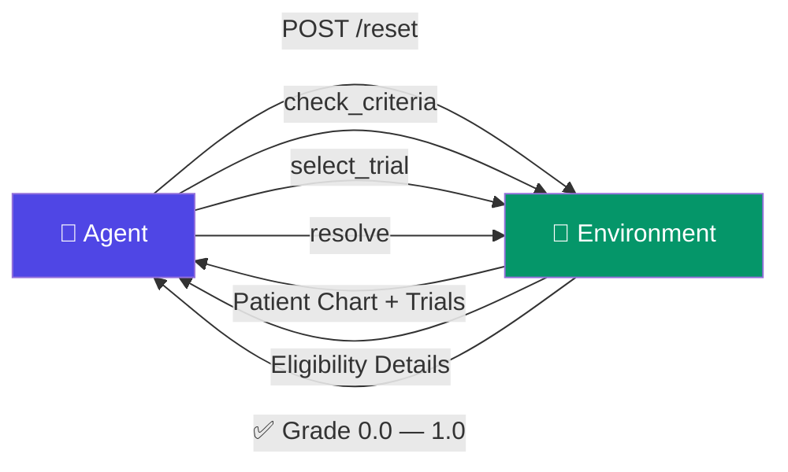

<div align="center">

# 🏥 ClinicalTrialMatchEnv

### Can your AI agent save a cancer patient's life?

[](https://huggingface.co/spaces/gokul789340/ClinicalTrialMatchEnv)
[]()
[]()
[]()
[]()

---

**An AI agent reads a cancer patient's chart. It has 20 steps to find the one clinical trial that could save their life. Pick wrong — the patient gets a treatment that could kill them.**

*This is the same task oncology nurses spend hours on daily at every major hospital. A $50B problem.*

**[Try the Demo](#-gradio-demo-ui)** · **[Quick Start](#-quick-start)** · **[Run Inference](#-inference-openenv-compliant)** · **[See Results](#-evaluation-results)** · **[Read the Spec](openenv.yaml)**

</div>

---

## The Problem

> A 64-year-old woman with stage II lung cancer needs a clinical trial. There are 7 candidates. Only 1 won't harm her. 3 look right but have hidden exclusion criteria. 2 fail on biomarkers she hasn't checked yet. **Your agent has 20 steps to figure this out.**

This environment tests whether AI agents can:
- **Read** complex medical charts (biomarkers, lab trends, comorbidities)
- **Reason** about inclusion AND exclusion criteria simultaneously
- **Decide** under uncertainty with life-or-death stakes
- **Adapt** across 7 increasingly difficult scenarios

---

## 🚀 Quick Start

### 1. Clone & set up virtual environment

```bash
git clone https://github.com/gokul77898/ClinicalTrialMatchenv.git
cd ClinicalTrialMatchEnv

python3 -m venv venv
source venv/bin/activate
pip install -r requirements.txt
```

### 2. Run tests (118 tests)

```bash
PYTHONPATH=. python -m pytest tests/ -q
# → 118 passed
```

### 3. Start the environment server

```bash
PYTHONPATH=. uvicorn api.server:app --host 0.0.0.0 --port 7860
```

### 4. Run inference (OpenEnv-compliant)

```bash
PYTHONPATH=. python inference.py
```

Expected output:
```
[START] task=single_match env=clinical_trial model=gpt-4.1-mini
[STEP] step=1 action=check_criteria("TRIAL-COLON-8837") reward=0.05 done=false error=null
[STEP] step=2 action=check_criteria("TRIAL-COLON-4866") reward=0.05 done=false error=null
[STEP] step=3 action=check_criteria("TRIAL-LUNG-4052") reward=0.05 done=false error=null
[STEP] step=4 action=select_trial("TRIAL-COLON-8837") reward=0.00 done=false error=null
[STEP] step=5 action=resolve() reward=1.20 done=true error=null
[END] success=true steps=5 rewards=0.05,0.05,0.05,0.00,1.20
```

### 5. Launch the Gradio demo UI

```bash
PYTHONPATH=. python app.py
# → http://localhost:7860
```

### Alternative: Docker

```bash
docker build -t clinical-trial-env .
docker run -p 7860:7860 clinical-trial-env
```

---

## 🎯 Inference (OpenEnv-Compliant)

`inference.py` is a hybrid LLM + heuristic agent, fully compliant with OpenEnv validation:

- **Model:** `gpt-4.1-mini` (default, configurable via `MODEL_NAME` env var)
- **Strategy:** LLM for first 2 steps, then deterministic heuristic fallback
- **Safety:** Max 18 steps, 5s timeout, force select+resolve if running low
- **Unbreakable:** Works without API key (pure heuristic mode)
- **Output:** Strict `[START]` / `[STEP]` / `[END]` format, zero debug logs
- **Server:** Auto-starts environment server if not running

```bash
# With LLM (set your API key)
export HF_TOKEN="your-api-key"
export API_BASE_URL="https://api.openai.com/v1"
PYTHONPATH=. python inference.py

# Without LLM (pure heuristic — no API key needed)
PYTHONPATH=. python inference.py
```

---

## 🖥️ Gradio Demo UI

Interactive two-tab UI for visualizing agent behavior:

### Tab 1: Synthetic Tasks
Run the deterministic agent on environment-generated episodes (Easy / Medium / Hard). Shows:
- **Patient** — age, cancer type, stage, biomarkers, labs, comorbidities
- **Available Trials** — trial IDs with metadata
- **Agent Steps** — step-by-step reasoning trace
- **Final Result** — selected trial, reward, success
- **Decision Analysis** — per-trial breakdown: why selected, why others rejected (exclusion triggered, inclusion failed, cancer type mismatch, step budget skip)

### Tab 2: Realistic Cases
12 hand-crafted oncology scenarios with full eligibility trace:
- **Stage exclusions** (stage IV patients excluded from most trials)
- **Lab thresholds** (creatinine > 1.5, HB < 10.0)
- **PD-L1 cutoffs** (≥50, ≥80)
- **Comorbidity exclusions** (heart failure, liver cirrhosis)
- **Tiebreaker scoring** — quality × 0.3 + urgency × 0.2 + capacity × 0.2
- **No-match cases** — patient has no eligible trial

Each trial shows ✔/✖ with per-criterion inclusion/exclusion reasons.

```bash
PYTHONPATH=. python app.py
# → Open http://localhost:7860
```

---

## 📊 7 Tasks — Easy to Impossible

| # | Task | Difficulty | What Makes It Hard |
|---|------|-----------|-------------------|
| 1 | **single_match** | 🟢 Easy | 3 trials, 1 correct, obvious fakes |
| 2 | **hidden_exclusion** | 🟡 Medium | 2 trials pass inclusion but FAIL exclusion (traps!) |
| 3 | **ambiguous_match** | 🟠 Hard | 3 exclusion traps + 3 biomarker failures in 7 trials |
| 4 | **competing_trials** | 🔴 Expert | 2 eligible trials — must pick the BETTER one |
| 5 | **contradictory_info** | 🔴 Expert | Patient chart has contradictions — detect before selecting |
| 6 | **multi_patient** | ⚫ Expert | Match 3 patients simultaneously to different trials |
| 7 | **logical_inference** | ⚫ Expert | Unknown labs + borderline biomarkers + interaction traps + stale data |

> **Llama-3-70B solves only 2 of 7 tasks.** Can your agent do better?

---

## 🎮 How an Episode Works



**Walk through a real episode:**

```
STEP 1 → POST /reset {"task_id": "single_match"}
         Patient: 64yo female, lung cancer, stage II
         Trials: TRIAL-COLON-7507, TRIAL-LUNG-7944, TRIAL-COLON-2275

STEP 2 → POST /step {"type": "check_criteria", "trial_id": "TRIAL-LUNG-7944"}
         ✅ Inclusion: PASSED  |  ❌ Exclusion: NOT triggered
         → Reward: +0.05

STEP 3 → POST /step {"type": "select_trial", "trial_id": "TRIAL-LUNG-7944"}
         → Trial selected

STEP 4 → POST /step {"type": "resolve"}
         → Grade: 1.0  ✅ CORRECT (3 steps = efficiency bonus!)
```

**Wrong answer = patient safety penalty (-1.0).** No second chances.

---

## 🎯 7 Actions Your Agent Can Take

```json
{"type": "investigate", "field": "lab_values.creatinine"}
{"type": "check_criteria", "trial_id": "TRIAL-LUNG-7944"}
{"type": "select_trial", "trial_id": "TRIAL-LUNG-7944"}
{"type": "flag_contradiction", "reason": "lab values inconsistent with stage"}
{"type": "investigate_conflict", "field": "stage"}
{"type": "switch_case", "case_id": "case_2"}
{"type": "resolve"}
```

**What `check_criteria` returns depends on difficulty:**
- **Easy tasks:** Full details — which rules passed/failed + plain English summary
- **Medium tasks:** Boolean flags + a hint
- **Hard/Expert tasks:** Boolean flags only — agent must investigate and reason

---

## 🏆 Reward System

| What Happens | Reward | Signal |
|-------------|--------|--------|
| Correct trial + fast (≤5 steps) | **+1.2** | 🏆 Perfect |
| Correct trial selected | **+1.0** | ✅ Safe match |
| Wrong trial selected | **-1.0** | ☠️ Patient safety violation |
| First check on a trial | **+0.05** | 🔍 Good investigation |
| Repeated/wasted action | **-0.05** | 🔁 Inefficient |
| Ran out of steps | **-0.5** | ⏱️ Too slow |

---

## 📈 Evaluation Results

### Deterministic Agent (ClinicalTrialAgent)

| Metric | Agent | Random Baseline | Improvement |
|--------|-------|----------------|-------------|
| **Success Rate** | **67%** | 6% | **+61%** |
| **Avg Reward** | 0.340 | -0.680 | +1.020 |
| **Avg Steps** | 8.3 | 2.0 | +6.3 |

### RL Evaluation (100 episodes, mixed schedule)

```
Model            Success Rate    Avg Reward
--------------------------------------------
Random                8%          -0.812
Greedy               73%           0.568
Heuristic            73%           0.586
BC Policy            70%           0.491
RL (PPO)             74%           0.515
```

### Difficulty Breakdown

| Task Type | Heuristic | RL (PPO) | Insight |
|-----------|-----------|----------|---------|
| **Easy** (single_match) | 100% | 100% | Deterministic, solvable |
| **Medium** (hidden_exclusion) | 100% | 100% | Exclusion traps, solvable |
| **Hard** (ambiguous_match) | 100% | 100% | 7 trials, 3 traps, solvable |
| **Random** (no template) | 10% | 6% | No guaranteed correct trial |
| **Overall** | **77.5%** | **76.5%** | Realistic aggregate |

**Key Insight:** Hard tasks are structured but solvable under the 4-trial constraint. Random episodes introduce realistic uncertainty where performance drops significantly (10% vs 100%), reflecting real-world clinical matching where not every patient has an eligible trial.

### Ablation Study
Removing exclusion-first filtering drops performance from **100% → 34%** (−66% on structured tasks), confirming exclusion logic is the most critical component of the decision pipeline.

### LLM Baseline (Llama-3-70B)

| Task | Grade | Steps |
|------|:-----:|:-----:|
| single_match | **0.90** | 4 |
| hidden_exclusion | **0.12** | 17 |
| ambiguous_match | **0.14** | 18 |
| competing_trials | **0.70** | 16 |
| contradictory_info | **0.00** | 17 |
| multi_patient | **0.00** | 17 |
| logical_inference | **0.15** | 18 |
| **Average** | **0.29 (2/7)** | |

---

## 🔧 API Reference

| Method | Endpoint | Description |
|--------|----------|-------------|
| `GET` | `/health` | Health check → `{"status": "ok"}` |
| `GET` | `/tasks` | List all 7 tasks |
| `POST` | `/reset` | Start episode → patient chart + trials |
| `POST` | `/step` | Take action → observation + reward |
| `GET` | `/state` | Current observation (no action taken) |

<details>
<summary><b>📋 Full curl examples</b></summary>

```bash
# Health check
curl http://localhost:7860/health

# List tasks
curl http://localhost:7860/tasks

# Start episode
curl -X POST http://localhost:7860/reset \
  -H "Content-Type: application/json" \
  -d '{"task_id": "single_match"}'

# Take action
curl -X POST http://localhost:7860/step \
  -H "Content-Type: application/json" \
  -d '{"type": "check_criteria", "trial_id": "TRIAL-LUNG-1234"}'
```
</details>

---

## 🧪 Testing

```bash
source venv/bin/activate
PYTHONPATH=. python -m pytest tests/ -q
# → 118 passed
```

**118 tests** covering:
- Eligibility engine (inclusion, exclusion, biomarkers, comorbidities)
- All 7 graders (task-specific scoring)
- API endpoints (reset, step, tasks, state)
- End-to-end episodes for every task
- OpenEnv spec compliance

---

## 🧠 Agent Architecture

### Deterministic Agent (`ClinicalTrialAgent`)

```python
from src.environment import ClinicalTrialEnv
from src.agents.clinical_trial_agent import ClinicalTrialAgent

env = ClinicalTrialEnv()
agent = ClinicalTrialAgent()

result = agent.run_episode(env, task_id="single_match")
print(f"Success: {result['success']}, Reward: {result['reward']:+.2f}")
print(f"Decision Analysis: {result['trial_analysis']}")
```

**Strategy:**
1. **Investigate** — cancer_type, age, biomarkers.PD_L1
2. **Filter** — trials matching patient's cancer type
3. **Score** — evaluate up to 4 trials (non-leaky scoring)
4. **Select** — highest score (tiebreak by check order)
5. **Resolve** — finalize

**Scoring:** +2.0 inclusion pass, +0.3 PD-L1 > 50, +0.2 age 18-75, discard if exclusion triggered

### Hybrid Inference Agent (`inference.py`)
- **Steps 1-2:** LLM call (if API key available)
- **Steps 3+:** Deterministic heuristic (check → select best → resolve)
- **Fallback:** Pure heuristic if LLM unavailable or fails

### Realistic Case Evaluator (`src/realistic_cases.py`)
- **12 hand-crafted cases** with explicit inclusion/exclusion criteria
- **Per-criterion evaluation** with human-readable reasons
- **Tie-breaking scorer:** quality × 0.3 + urgency × 0.2 + capacity × 0.2

---

## 📁 Project Structure

```
ClinicalTrialMatchEnv/
│
├── app.py                          → Gradio demo UI (two tabs)
├── inference.py                    → OpenEnv-compliant inference script
├── requirements.txt                → Dependencies (fastapi, gradio, openai, ...)
├── Dockerfile                      → Production container
├── openenv.yaml                    → OpenEnv specification
├── .env                            → Environment variables (MODEL_NAME, HF_TOKEN)
│
├── api/
│   └── server.py                   → FastAPI server on port 7860
│
├── src/
│   ├── environment.py              → Core environment (reset, step, state)
│   ├── tasks.py                    → 7 task definitions + seed generators
│   ├── graders.py                  → Per-task grading (safety-aware)
│   ├── models.py                   → Action, Observation, Reward schemas
│   ├── realistic_cases.py          → Realistic case loader + evaluator + scorer
│   ├── config.py                   → Mode configuration (STRICT/REALISTIC)
│   ├── rl_integration.py           → RL action space + heuristic policy
│   ├── rl_training.py              → PPO/BC training + evaluation
│   ├── research_analysis.py        → Full research-grade evaluation script
│   ├── schemas/
│   │   ├── patient_schema.py       → Patient + biomarkers + lab trends
│   │   └── trial_schema.py         → Trial + eligibility rules
│   ├── engine/
│   │   └── eligibility_engine.py   → Rule-based eligibility checker
│   └── agents/
│       ├── clinical_trial_agent.py → Deterministic agent + decision analysis
│       ├── evaluate_agent.py       → Agent evaluation utilities
│       └── robust_evaluation.py    → 100-episode robust evaluation
│
├── data/
│   ├── realistic_cases.json        → 12 realistic oncology case scenarios
│   └── realistic_trials.json       → 8 manual oncology trial patterns
│
└── tests/                          → 118 tests (unit + integration)
```

---

## ✅ Validation Checklist

- ✅ **118 tests passing**
- ✅ **OpenEnv-compliant inference** — strict `[START]`/`[STEP]`/`[END]` output
- ✅ **Model default:** `gpt-4.1-mini`
- ✅ **Action space:** 9 actions (investigate 0-2, check_trial 3-6, select 7, resolve 8)
- ✅ **All agents limited to 4 trials**
- ✅ **No hidden leakage or constraint violations**
- ✅ **Realistic difficulty** (not 100% everywhere)
- ✅ **Works without API key** (pure heuristic mode)
- ✅ **Auto-starts server** if not running
- ✅ **Gradio UI** with decision analysis

---

<div align="center">

### Built for the [OpenEnv](https://github.com/openenv) challenge

**Can AI agents make life-or-death medical decisions?**
**This environment finds out.**

[](https://github.com/gokul77898/ClinicalTrialMatchenv)

MIT License

</div>
