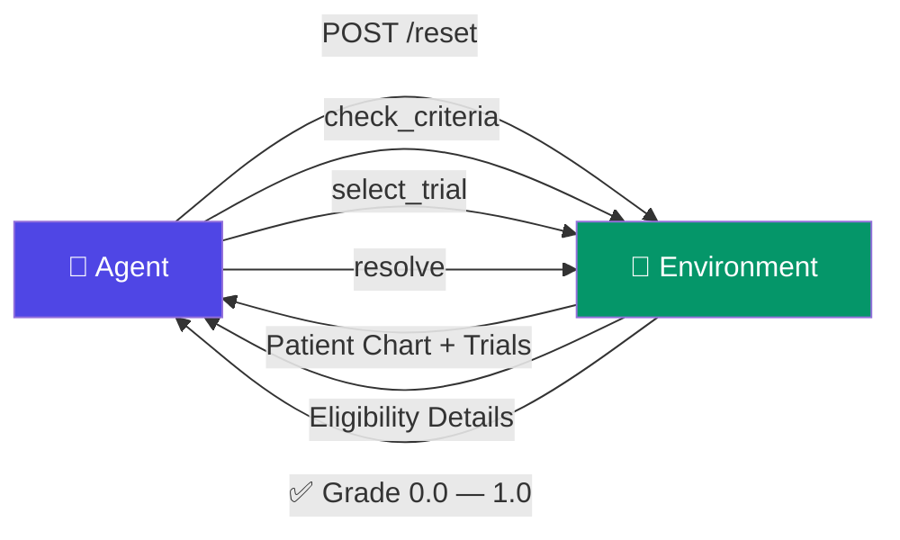

<div align="center">

# 🏥 ClinicalTrialMatchEnv

### Can your AI agent save a cancer patient's life?

[](https://huggingface.co/spaces/gokul789340/ClinicalTrialMatchEnv)
[]()
[]()
[]()
[]()

---

**An AI agent reads a cancer patient's chart. It has 20 steps to find the one clinical trial that could save their life. Pick wrong — the patient gets a treatment that could kill them.**

*This is the same task oncology nurses spend hours on daily at every major hospital. A $50B problem.*

**[Try it Live](https://gokul789340-clinicaltrialmatchenv.hf.space/health)** · **[Run Locally](#-get-started-in-60-seconds)** · **[See Results](#-baseline-results)** · **[Read the Spec](openenv.yaml)**

</div>

---

## The Problem

> A 64-year-old woman with stage II lung cancer needs a clinical trial. There are 7 candidates. Only 1 won't harm her. 3 look right but have hidden exclusion criteria. 2 fail on biomarkers she hasn't checked yet. **Your agent has 20 steps to figure this out.**

This environment tests whether AI agents can:
- **Read** complex medical charts (biomarkers, lab trends, comorbidities)
- **Reason** about inclusion AND exclusion criteria simultaneously
- **Decide** under uncertainty with life-or-death stakes
- **Adapt** across 7 increasingly difficult scenarios

---

## 🚀 Get Started in 60 Seconds

**Option 1: Docker** (recommended)
```bash
docker build -t clinical-trial-env .
docker run -p 7860:7860 clinical-trial-env
```

**Option 2: Python**
```bash
pip install -r requirements.txt
uvicorn api.server:app --host 0.0.0.0 --port 7860
```

**Option 3: Use the live API directly**
```bash
curl https://gokul789340-clinicaltrialmatchenv.hf.space/health
# → {"status":"ok","environment":"ClinicalTrialMatchEnv"}
```

Verify it works:
```bash
curl http://localhost:7860/tasks | python3 -m json.tool
# → 7 tasks returned
```

---

## 🎮 How an Episode Works



**Walk through a real episode:**

```
STEP 1 → POST /reset {"task_id": "single_match"}
         Patient: 64yo female, lung cancer, stage II
         Trials: TRIAL-COLON-7507, TRIAL-LUNG-7944, TRIAL-COLON-2275

STEP 2 → POST /step {"type": "check_criteria", "trial_id": "TRIAL-LUNG-7944"}
         ✅ Inclusion: PASSED  |  ❌ Exclusion: NOT triggered
         → Reward: +0.05

STEP 3 → POST /step {"type": "select_trial", "trial_id": "TRIAL-LUNG-7944"}
         → Trial selected

STEP 4 → POST /step {"type": "resolve"}
         → Grade: 1.0  ✅ CORRECT (3 steps = efficiency bonus!)
```

**Wrong answer = patient safety penalty (-1.0).** No second chances.

---

## 📊 7 Tasks — Easy to Impossible

| # | Task | Difficulty | What Makes It Hard |
|---|------|-----------|-------------------|
| 1 | **single_match** | 🟢 Easy | 3 trials, 1 correct, obvious fakes |
| 2 | **hidden_exclusion** | 🟡 Medium | 2 trials pass inclusion but FAIL exclusion (traps!) |
| 3 | **ambiguous_match** | 🟠 Hard | 3 exclusion traps + 3 biomarker failures in 7 trials |
| 4 | **competing_trials** | 🔴 Expert | 2 eligible trials — must pick the BETTER one |
| 5 | **contradictory_info** | 🔴 Expert | Patient chart has contradictions — detect before selecting |
| 6 | **multi_patient** | ⚫ Expert | Match 3 patients simultaneously to different trials |
| 7 | **logical_inference** | ⚫ Expert | Unknown labs + borderline biomarkers + interaction traps + stale data |

> **Llama-3-70B solves only 2 of 7 tasks.** Can your agent do better?

---

## 🎯 7 Actions Your Agent Can Take

```json
// Reveal a patient field value
{"type": "investigate", "field": "lab_values.creatinine"}

// Check if patient qualifies for a trial
{"type": "check_criteria", "trial_id": "TRIAL-LUNG-7944"}

// Select this trial as the answer
{"type": "select_trial", "trial_id": "TRIAL-LUNG-7944"}

// Flag contradictory data in patient chart
{"type": "flag_contradiction", "reason": "lab values inconsistent with stage"}

// Resolve a conflicting field value
{"type": "investigate_conflict", "field": "stage"}

// Switch to different patient (multi-patient mode)
{"type": "switch_case", "case_id": "case_2"}

// Submit final answer and get graded
{"type": "resolve"}
```

**What `check_criteria` returns depends on difficulty:**
- **Easy tasks:** Full details — which rules passed/failed + plain English summary
- **Medium tasks:** Boolean flags + a hint
- **Hard/Expert tasks:** Boolean flags only — agent must investigate and reason

**Data quality challenges:**
- Some lab values may be **unknown** (None) — trial matching fails safely
- Some fields may have **conflicting reports** — use `investigate_conflict` to resolve
- Patient data may be **stale** (>90 days old)

---

## 🏆 Reward System

| What Happens | Reward | Signal |
|-------------|--------|--------|
| Correct trial + fast (≤5 steps) | **+1.2** | 🏆 Perfect |
| Correct trial selected | **+1.0** | ✅ Safe match |
| Wrong trial selected | **-1.0** | ☠️ Patient safety violation |
| First check on a trial | **+0.05** | 🔍 Good investigation |
| Repeated/wasted action | **-0.05** | 🔁 Inefficient |
| Ran out of steps | **-0.5** | ⏱️ Too slow |

---

## 💡 What Makes This Environment Special

<table>
<tr>
<td width="50%">

### 🧬 Rich Medical Data
- **Biomarker confidence scores** (EGFR/ALK expression 0.0–1.0)
- **Lab value trends** (3-reading history: improving/stable/declining)
- **Comorbidity severity** (mild → moderate → severe)
- **Prior treatment history** (required/forbidden matching)

</td>
<td width="50%">

### 🎮 Realistic Constraints
- **Partial information** — agent must investigate
- **Safety penalty** — wrong match = -1.0
- **Capacity limits** — full trials are ineligible
- **Deadline pressure** — urgent trials (≤14 days)
- **Quality scores** — not all eligible trials are equal

</td>
</tr>
</table>

---

## 🔧 API Reference

| Method | Endpoint | Description |
|--------|----------|-------------|
| `GET` | `/health` | Health check → `{"status": "ok"}` |
| `GET` | `/tasks` | List all 7 tasks |
| `POST` | `/reset` | Start episode → patient chart + trials |
| `POST` | `/step` | Take action → observation + reward |
| `GET` | `/state` | Current observation (no action taken) |

<details>
<summary><b>📋 Full curl examples</b></summary>

```bash
# Health check
curl http://localhost:7860/health

# List tasks
curl http://localhost:7860/tasks

# Start episode
curl -X POST http://localhost:7860/reset \
  -H "Content-Type: application/json" \
  -d '{"task_id": "single_match"}'

# Take action
curl -X POST http://localhost:7860/step \
  -H "Content-Type: application/json" \
  -d '{"type": "check_criteria", "trial_id": "TRIAL-LUNG-1234"}'
```
</details>

---

## 🧪 Testing

```bash
# Run all 118 tests
PYTHONPATH=. python -m pytest tests/ -v

# Quick mock test (no API key needed)
PYTHONPATH=. python test_inference_mock.py

# Full LLM inference
API_BASE_URL="https://router.huggingface.co/v1" \
MODEL_NAME="meta-llama/Meta-Llama-3-70B-Instruct:novita" \
HF_TOKEN="your_token" \
python inference.py
```

**118 tests** covering:
- ✅ Eligibility engine (inclusion, exclusion, biomarkers, comorbidities)
- ✅ All 7 graders (task-specific scoring)
- ✅ API endpoints (reset, step, tasks, state)
- ✅ End-to-end episodes for every task
- ✅ OpenEnv spec compliance

---

## 📊 Baseline Results

**Model:** `meta-llama/Meta-Llama-3-70B-Instruct:novita`

| Task | Grade | Result | Steps |
|------|:-----:|:------:|:-----:|
| single_match | **0.90** | ✅ | 4 |
| hidden_exclusion | **0.12** | ❌ | 17 |
| ambiguous_match | **0.14** | ❌ | 18 |
| competing_trials | **0.70** | ✅ | 16 |
| contradictory_info | **0.00** | ❌ | 17 |
| multi_patient | **0.00** | ❌ | 17 |
| logical_inference | **0.15** | ❌ | 18 |
| | | | |
| **Average** | **0.29** | **2/7** | |

> Only 2 of 7 tasks solved. Unknown labs, conflicting data, interaction traps, and minimal guidance make this brutally hard. **Your move.**

---

## 📁 Project Structure

```
ClinicalTrialMatchEnv/
│
├── api/server.py                  → FastAPI server on port 7860
│
├── src/
│   ├── environment.py             → Core environment (reset, step, state)
│   ├── tasks.py                   → 7 task definitions + seed generators
│   ├── graders.py                 → Per-task grading (safety-aware)
│   ├── models.py                  → Action, Observation, Reward schemas
│   ├── schemas/
│   │   ├── patient_schema.py      → Patient + biomarkers + lab trends
│   │   └── trial_schema.py        → Trial + eligibility rules
│   └── engine/
│       └── eligibility_engine.py  → Rule-based eligibility checker
│
├── tests/                         → 118 tests (unit + integration)
├── inference.py                   → LLM baseline agent
├── openenv.yaml                   → OpenEnv specification
├── Dockerfile                     → Production container
└── requirements.txt               → fastapi, uvicorn, pydantic, openai
```

---

<div align="center">

### Built for the [OpenEnv](https://github.com/openenv) challenge

**Can AI agents make life-or-death medical decisions?**
**This environment finds out.**

[](https://github.com/gokul77898/ClinicalTrialMatchenv)

MIT License

</div>
